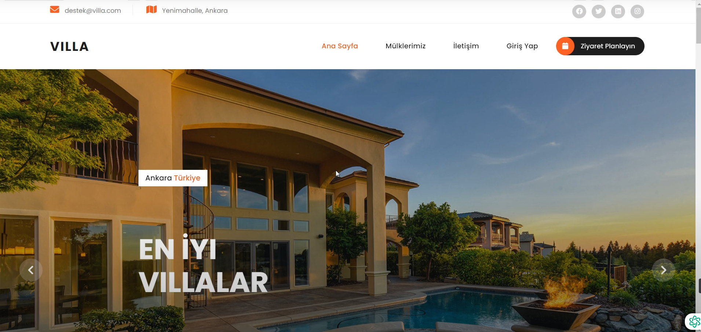
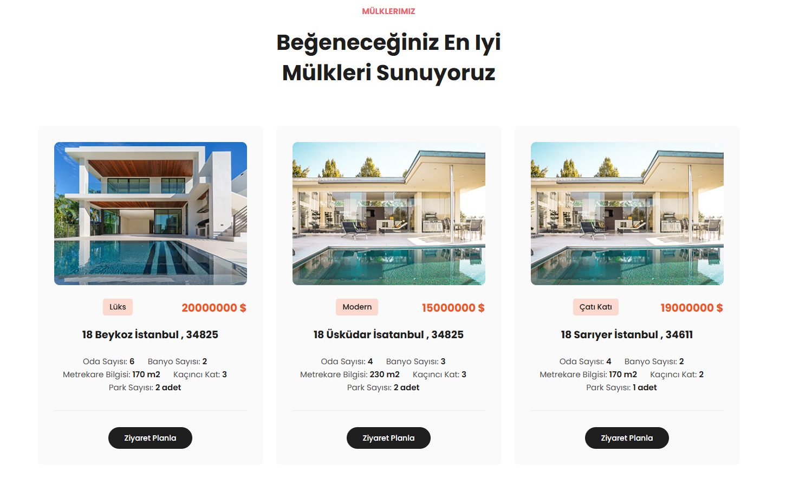
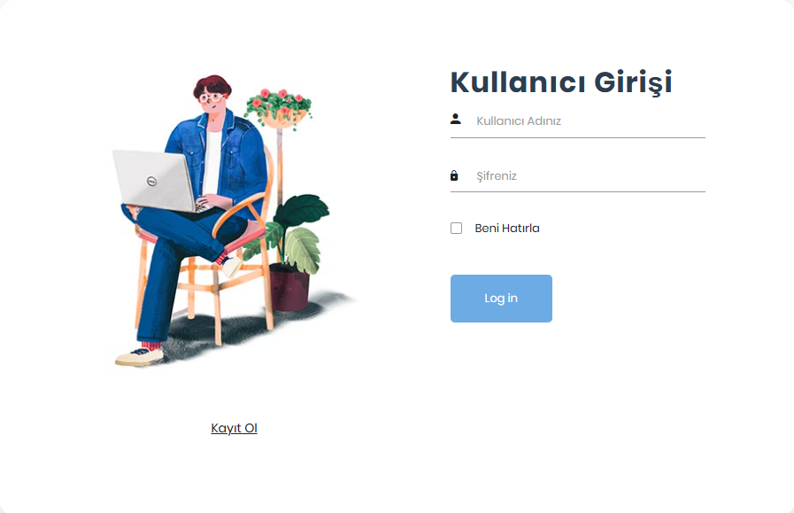
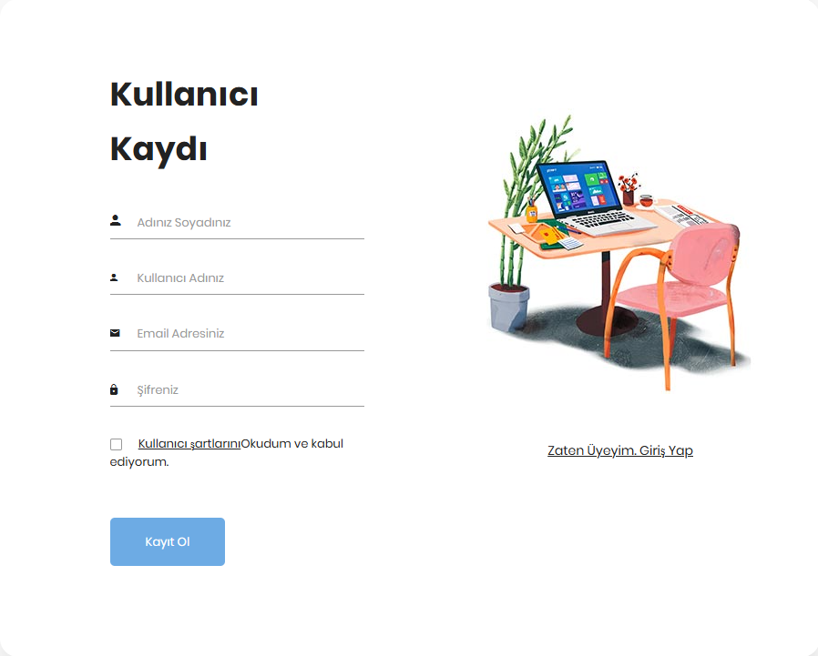
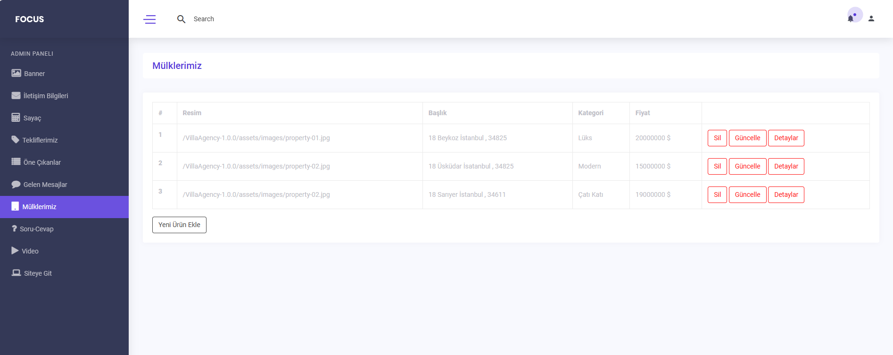
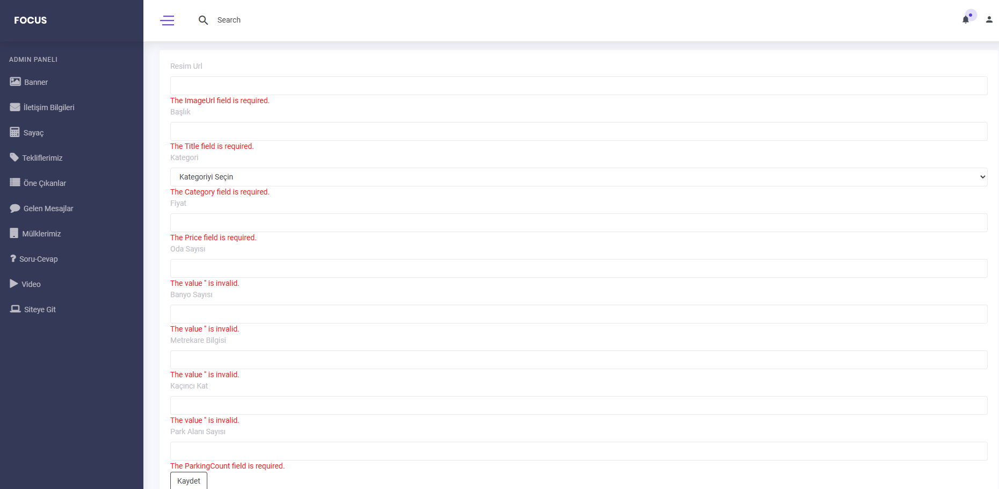

<!-- Improved compatibility of back to top link: See: https://github.com/othneildrew/Best-README-Template/pull/73 -->
<a id="readme-top"></a>

<!-- PROJECT SHIELDS -->
[![MIT License][license-shield]][license-url]


<!-- PROJECT LOGO -->
<br />
<div>

  <h2 align="center">Villa App</h2>

  <p align="center">
    <br />
    
  </p>
</div>

<!-- TABLE OF CONTENTS -->
<details>
  <summary>Table of Contents</summary>
  <ol>
    <li><a href="#about-the-project">About The Project</a></li>
    <li><a href="#getting-started">Getting Started</a>
      <ul>
        <li><a href="#prerequisites">Prerequisites</a></li>
        <li><a href="#installation">Installation</a></li>
      </ul>
    </li>
    <li><a href="#usage">Usage</a></li>
    <li><a href="#technologies-used">Technologies Used</a></li>
    <li><a href="#license">License</a></li>
    <li><a href="#contact">Contact</a></li>
  </ol>
</details>

<!-- ABOUT THE PROJECT -->
## About The Project



The **Villa Management System** is built using **.NET Core** and **MongoDB** to manage villa listings efficiently. This system implements modern software development practices and follows a **multi-layered (N-Tier) architecture** for better scalability and maintainability. 

- **Key Features**:
  - Admin panel for managing villa listings
  - Secure user authentication using **ASP.NET Core Identity**
  - Validation for input models using **FluentValidation**
  - Use of **AutoMapper** for data mapping between models and DTOs
  - MongoDB as a NoSQL database for fast, scalable data storage

<p align="right">(<a href="#readme-top">back to top</a>)</p>

<!-- GETTING STARTED -->
## Getting Started

To get started with the Villa App project, follow these steps to set it up and run it on your local machine.

### Prerequisites

Before running the project, make sure you have the following tools installed:

- **.NET SDK**: Install .NET Core 8.0 or newer. [Download .NET SDK](https://dotnet.microsoft.com/download)
- **MongoDB Server**: Install MongoDB for database management. [Download MongoDB Server](https://www.mongodb.com/try/download/community)

### Installation

Follow these steps to install and set up the application:

1. Clone the repository
   ```sh
   git clone https://github.com/1mertyuksel/.NetCore_MongoDB_VillaApp.git


<p align="right">(<a href="#readme-top">back to top</a>)</p>


<!-- USAGE EXAMPLES -->
## Usage

### 1. Home Page
- View available villas and their details.




### 2. Admin Login Page
- Secure login for administrators to manage the application.




### 3. Villa Management (Admin Panel)
- Add, edit, or delete villa listings.





<p align="right">(<a href="#readme-top">back to top</a>)</p>

<!-- TECHNOLOGIES USED -->
## Technologies Used

- **.NET Core**: The primary framework for building this application.
- **MongoDB**: NoSQL database for storing villa data.
- **Entity Framework Core**: For handling database operations.
- **FluentValidation**: For clean and structured validation of input models.
- **Identity**: For user authentication and authorization.
- **N-Tier Architecture**: A multi-layered structure for scalability and maintainability.
- **AutoMapper**: For mapping data transfer objects (DTOs) to models and vice versa.
- **Components**: Modular views using Razor Components.
- **MVC**: The Model-View-Controller design pattern.

<!-- LICENSE -->
## License

Distributed under the MIT License. See [LICENSE.txt](./LICENSE.txt) for more information.

<p align="right">(<a href="#readme-top">back to top</a>)</p>

<!-- CONTACT -->
## Contact

I’d love to hear from you! Whether you have questions, feedback, or just want to connect, feel free to reach out to me through the following channels:

- **Mert Yüksel** - [LinkedIn](https://www.linkedin.com/in/mert-yüksel/) - mertyuksel680@gmail.com  
  Feel free to connect with me on LinkedIn for updates and professional networking. For any inquiries or support, don’t hesitate to drop me an email. I am here to assist you and look forward to engaging with you!
<a href="mailto:mertyuksel680@gmail.com?subject=Bug%20Report">Report Bug</a>

Project Link: [Villa App](https://github.com/1mertyuksel/.NetCore_MongoDB_VillaApp)

<p align="right">(<a href="#readme-top">back to top</a>)</p>

<!-- MARKDOWN LINKS & IMAGES -->
<!-- https://www.markdownguide.org/basic-syntax/#reference-style-links -->
[contributors-shield]: https://img.shields.io/github/contributors/othneildrew/Best-README-Template.svg?style=for-the-badge
[contributors-url]: https://github.com/othneildrew/Best-README-Template/graphs/contributors
[forks-shield]: https://img.shields.io/github/forks/othneildrew/Best-README-Template.svg?style=for-the-badge
[forks-url]: https://github.com/othneildrew/Best-README-Template/network/members
[stars-shield]: https://img.shields.io/github/stars/othneildrew/Best-README-Template.svg?style=for-the-badge
[stars-url]: https://github.com/othneildrew/Best-README-Template/stargazers
[issues-shield]: https://img.shields.io/github/issues/othneildrew/Best-README-Template.svg?style=for-the-badge
[issues-url]: https://github.com/othneildrew/Best-README-Template/issues
[license-shield]: https://img.shields.io/github/license/othneildrew/Best-README-Template.svg?style=for-the-badge
[license-url]: https://github.com/othneildrew/Best-README-Template/blob/master/LICENSE.txt
[linkedin-shield]: https://img.shields.io/badge/-LinkedIn-black.svg?style=for-the-badge&logo=linkedin&colorB=555
[linkedin-url]: https://linkedin.com/in/othneildrew
[product-screenshot]: images/screenshot.png
[Next.js]: https://img.shields.io/badge/next.js-000000?style=for-the-badge&logo=nextdotjs&logoColor=white
[Next-url]: https://nextjs.org/
[React.js]: https://img.shields.io/badge/React-20232A?style=for-the-badge&logo=react&logoColor=61DAFB
[React-url]: https://reactjs.org/
[Vue.js]: https://img.shields.io/badge/Vue.js-35495E?style=for-the-badge&logo=vuedotjs&logoColor=4FC08D
[Vue-url]: https://vuejs.org/
[Angular.io]: https://img.shields.io/badge/Angular-DD0031?style=for-the-badge&logo=angular&logoColor=white
[Angular-url]: https://angular.io/
[Svelte.dev]: https://img.shields.io/badge/Svelte-4A4A55?style=for-the-badge&logo=svelte&logoColor=FF3E00
[Svelte-url]: https://svelte.dev/
[Laravel.com]: https://img.shields.io/badge/Laravel-FF2D20?style=for-the-badge&logo=laravel&logoColor=white
[Laravel-url]: https://laravel.com
[Bootstrap.com]: https://img.shields.io/badge/Bootstrap-563D7C?style=for-the-badge&logo=bootstrap&logoColor=white
[Bootstrap-url]: https://getbootstrap.com
[JQuery.com]: https://img.shields.io/badge/jQuery-0769AD?style=for-the-badge&logo=jquery&logoColor=white
[JQuery-url]: https://jquery.com
